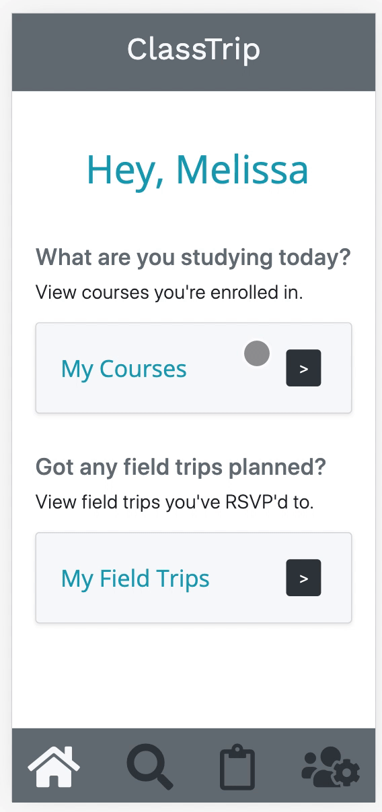

# ClassTrip

### Under Construction
A web app for people who want to learn online, while staying connected with local course-mates who plan field trips.

## Technologies Used
- React
- Webpack 4
- Bootstrap 4
- Node.js
- PostgreSQL

## Live Demo
[Try ClassTrip](https://class-trip.jasminegallardo.com/ "ClassTrip")

## Features
- User can view their courses
- User can view their field trips
- User can take a course
- User can search for courses by category
- User can search for field trips by category
- User can create a field trip


## Preview


## Development

### System Requirements
- Node.js 10 or higher
- NPM 6 or higher
- PostgreSQL 10 or higher
- Express 4 or higher

### Getting Started

1. Clone this repository.
```shell
git clone https://github.com/jasmine-gallardo/final-project-lfz
cd final-project-lfz
```

2. Install all dependencies with NPM.
```shell
npm install
```

3. Start PostgreSQL server in another terminal.
```shell
sudo service postgresql start
```

4. In your first terminal, create the database.
```shell
createdb classTrip
```

5. Import the database to PostgreSQL.
```shell
npm run db:import
```

6. Access the classTrip PostgreSQL database server using pgweb in your default web browser.
```shell
pgweb --db=classTrip
```

7. Start the project. You can view the application by opening http://localhost:3000 in your browser.
```shell
npm run dev
```
